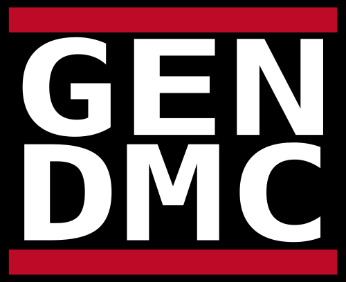

= Web Version
There's a web version hosted at this repo's GitHub Pages site: https://kmein.github.io/gen-dmc.
It has all features the CLI has.

= CLI

== Obtaining
1. install the Nix package manager
2. run `nix-build -E '(import <nixpkgs> {}).callPackage ./. {}'` to build
3. enjoy your binary, which is located in `./result/bin`

== Usage Examples

* `gendmc RUNDMC -o rundmc.svg -w 500`
* `gendmc NIXPKG --fg 000000 --bg ffffff --frame 0000ff -o nixpkg.svg -w 500`
* `gendmc RUNBSD --frame ff0000 -o runbsd.svg -w 100`
